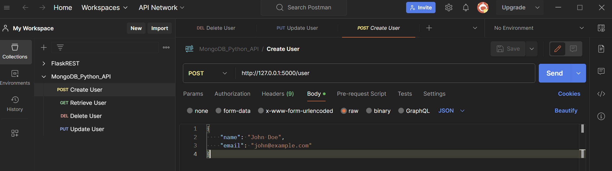

[← Back to Main README](../README.md)

# Testing Mongo CRUD API

## Testing with Postman

To test your Flask app with Postman, follow these steps for each CRUD operation. Ensure your Flask app is running (i.e., `app.run(debug=True)` is executed and the server is listening for requests). 

You can find and import this configuration in [MongoDB_Python_API.json](../tests/MongoDB_Python_API.postman_collection.json).

Here is an image how the project should look like at the end:



Below is a step by step guide on how to it on your own.


### 1. Testing `CREATE` Operations

#### **Add a Product**

1. **Set Request Type to `POST`**: In Postman, select `POST` from the dropdown.
2. **Enter URL**: Enter `http://localhost:5000/products`.
3. **Set Headers**: Set `Content-Type` to `application/json`.
4. **Enter Request Body**: Enter product details in JSON format.
   ```json
   {
     "product_id": "123",
     "name": "Example Product",
     "price": 29.99
   }
   ```
5. **Send Request**: Click `Send` and observe the response.

#### **Add a User**

Follow similar steps as above but use the `/users` endpoint and a user data JSON.

```json
{
    "username": "jonhdoe",
    "name": "John Doe",
    "email": "john@example.com"
}   
```

### 2. Testing `READ` Operations

#### **Get a Product**

1. **Set Request Type to `GET`**.
2. **Enter URL**: `http://localhost:5000/products/<product_id>`, replacing `<product_id>` with the actual product ID.
3. **Send Request**.

#### **Get a User**

Use the `/users/<username>` endpoint, replacing `<username>` with the actual username.

### 3. Testing `UPDATE` Operations

#### **Update a Product**

1. **Set Request Type to `PUT`**.
2. **Enter URL**: `http://localhost:5000/products/<product_id>`.
3. **Set Headers** and **Request Body**: Same as in `CREATE`, but with updated data.
4. **Send Request**.

#### **Update a User**

Use the `/users/<username>` endpoint with updated user data.

### 4. Testing `DELETE` Operations

#### **Delete a Product**

1. **Set Request Type to `DELETE`**.
2. **Enter URL**: `http://localhost:5000/products/<product_id>`.
3. **Send Request**.

#### **Delete a User**

Use the `/users/<username>` endpoint for deleting a user.

### Notes:

- Ensure that MongoDB is running and accessible.
- Replace placeholders like `<product_id>` and `<username>` with actual values present in your database.
- After creating an entity (product/users), use the returned ID or username for subsequent Read, Update, or Delete operations.
- For `PUT` requests, ensure your JSON body contains the fields you want to update.
- Always check the response in Postman for successful execution or error messages.

Testing with Postman allows you to simulate client requests to your API and observe the behavior of your Flask application, making it an essential tool for development and debugging.

## Testing with CURL

To test your Flask application using `curl`, you can perform requests from the command line for each of the CRUD operations. 

:warninig: In `WSL 2`, `localhost` or `127.0.0.1` from within `WSL` does not point to your `Windows` host by default due to its virtualized network architecture. You need to find the IP address of your `Windows` host as seen from `WSL`, this can be done in the host terminal with `ipconfig`.

Here are examples of `curl` commands for each type of request:

### 1. Testing `CREATE` Operations

#### **Add a Product**

<!-- 192.168.4.40 -->
<!-- curl -X POST http://192.168.4.40:5000/products \
-H "Content-Type: application/json" \
-d '{"product_id": "123", "name": "Example Product", "price": 29.99}' -->

```bash
curl -X POST http://localhost:5000/products \
-H "Content-Type: application/json" \
-d '{"product_id": "123", "name": "Example Product", "price": 29.99}'
```


#### **Add a User**

```bash
curl -X POST http://localhost:5000/users \
-H "Content-Type: application/json" \
-d '{"username": "johndoe", "email": "john@example.com"}'
```

### 2. Testing `READ` Operations

#### **Get a Product**

<!-- curl -X GET http://192.168.4.40:5000/products/123 -->

```bash
curl -X GET http://localhost:5000/products/123
```

Replace `123` with the actual `product_id`.

#### **Get a User**

```bash
curl -X GET http://localhost:5000/users/johndoe
```

Replace `johndoe` with the actual `username`.

### 3. Testing `UPDATE` Operations

#### **Update a Product**

<!-- curl -X PUT http://192.168.4.40:5000/products/123 \
-H "Content-Type: application/json" \
-d '{"name": "Updated Product Name", "price": 39.99}' -->

```bash
curl -X PUT http://localhost:5000/products/123 \
-H "Content-Type: application/json" \
-d '{"name": "Updated Product Name", "price": 39.99}'
```

Replace `123` with the `product_id` and adjust the JSON data as needed.

#### **Update a User**

```bash
curl -X PUT http://localhost:5000/users/johndoe \
-H "Content-Type: application/json" \
-d '{"email": "newjohn@example.com"}'
```

Replace `johndoe` with the `username` and adjust the JSON data as needed.

### 4. Testing `DELETE` Operations

#### **Delete a Product**

<!-- curl -X DELETE http://192.168.4.40:5000/products/123 -->

```bash
curl -X DELETE http://localhost:5000/products/123
```

Replace `123` with the `product_id`.

#### **Delete a User**

```bash
curl -X DELETE http://localhost:5000/users/johndoe
```

Replace `johndoe` with the `username`.

### Notes:

- Make sure your Flask application is running and listening on the specified port.
- Adjust the `product_id`, `username`, and data payload in the `curl` commands to match the actual data in your MongoDB.
- The `-H` flag is used to set the request's `Content-Type` header to `application/json` for POST and PUT requests.
- Use the `-X` flag to specify the request method (GET, POST, PUT, DELETE).
- The `-d` flag is used to provide the data payload for POST and PUT requests.

`curl` is a powerful tool for testing HTTP endpoints and is widely used for its versatility and availability in most operating systems.

## Testing with a web browser

Testing a web API through a web browser is straightforward for certain types of requests but limited in capability. In a browser, you can easily perform `GET` requests simply by navigating to a URL. However, for other types of requests like `POST`, `PUT`, and `DELETE`, which require a request body or specific headers, a browser isn't natively equipped. For these, you usually need additional tools or extensions.

Here's how you can test your Flask API with a web browser:

### Testing `GET` Requests

For `GET` requests, testing is as simple as entering the URL into the browser's address bar. For example:

- To get a product by its ID: `http://localhost:5000/products/<product_id>`
- To get a user by username: `http://localhost:5000/users/<username>`

Replace `<product_id>` and `<username>` with actual values from your database.

### Testing `POST`, `PUT`, and `DELETE` Requests

Browsers don't natively support sending `POST`, `PUT`, or `DELETE` requests directly from the address bar. To test these requests, you have a few options:

1. **Browser Extensions**: Tools like Postman also offer browser extensions. These extensions allow you to craft requests with different HTTP methods and custom headers and bodies.

2. **HTML Forms for POST Requests**: You can create a simple HTML form to send `POST` requests. This is somewhat limited, as forms typically send data with `application/x-www-form-urlencoded` or `multipart/form-data` content types, and handling `JSON` requires additional `JavaScript`.

   ```html
   <!DOCTYPE html>
   <html lang="en">
   <head>
       <meta charset="UTF-8">
       <title>Add Product</title>
   </head>
   <body>
       <h2>Add Product</h2>
       <form action="http://localhost:5000/products" method="post">
           <label for="product_id">Product ID:</label><br>
           <input type="text" id="product_id" name="product_id"><br>
   
           <label for="name">Name:</label><br>
           <input type="text" id="name" name="name"><br>
   
           <label for="price">Price:</label><br>
           <input type="text" id="price" name="price"><br><br>
   
           <input type="submit" value="Submit">
       </form>
   </body>
   </html>
   ```

3. **JavaScript**: For more advanced testing directly in the browser, you can use JavaScript (for example, via the browser's developer console) to send AJAX requests. This allows you to set custom headers and request bodies, enabling testing of `POST`, `PUT`, and `DELETE` requests.

   Example using `fetch` in the browser's console:
   ```javascript
   fetch('http://localhost:5000/products', {
     method: 'POST',
     headers: {
       'Content-Type': 'application/json'
     },
     body: JSON.stringify({ product_id: '123', name: 'Test Product', price: 19.99 })
   })
   .then(response => response.json())
   .then(data => console.log(data));
   ```

### Conclusion

Testing `GET` requests in a web browser is straightforward, but for other request types, consider using tools like Postman, browser extensions, or writing some quick JavaScript for a more comprehensive testing experience. These methods provide the flexibility needed for different HTTP methods and request content types.

---

[← Previous: Running your application with containers ](./DOCKER.md) | [Next: MongoDB Shell (mongosh) Cheat Sheet →](./MONGOSH.md)